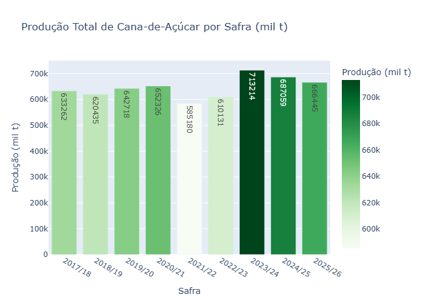
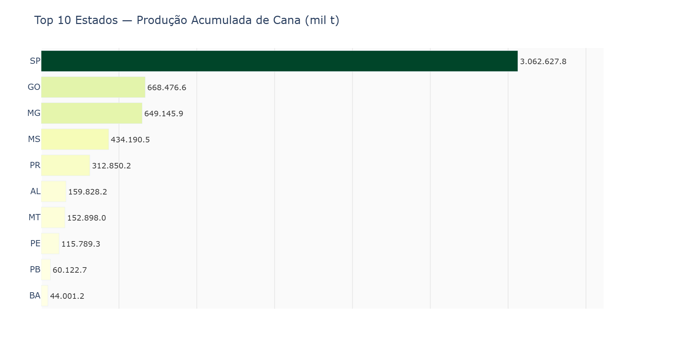
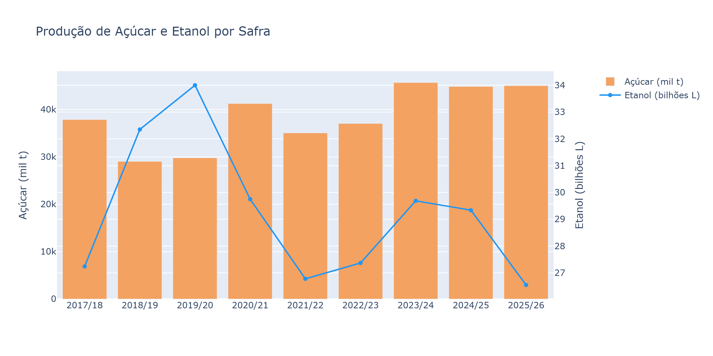
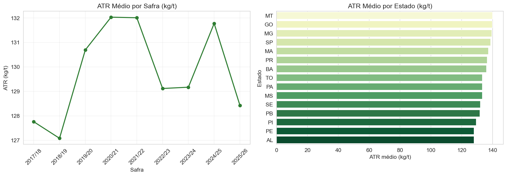
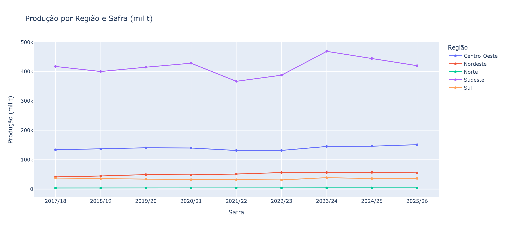
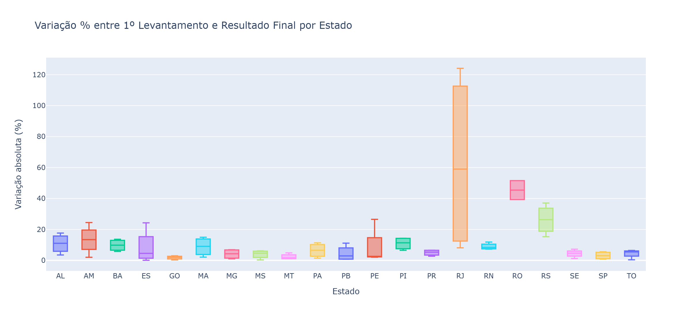

# 🎋 Análise de Performance e Evolução da Cana-de-Açúcar no Brasil

> Dados oficiais da CONAB — Companhia Nacional de Abastecimento | Safras 2017/18 a 2025/26

  

---

## 👤 Sobre o Projeto

A virada de safra tem um ritmo próprio. O campo desacelera, os relatórios fecham, e quem trabalha numa usina sabe que é nesse intervalo que as perguntas mais importantes aparecem — aquelas que os dados internos não respondem sozinhos.

Sou Analista de Controle Agrícola (CTT) e acompanho o ciclo da cana de dentro: do planejamento de plantio até o encerramento da moagem. Com o fim da safra 2025/26 e o arranque da 2026/27, me peguei querendo entender o Brasil além da minha região — como outros estados produzem, o que impacta o TCH nacional, e o que eventos como a geada de 2021 fizeram com o setor inteiro.

Este projeto nasceu disso. É minha primeira análise de dados construída do zero — do ETL às visualizações — usando dados públicos da CONAB. Feita com a curiosidade de quem vive esse ciclo todo ano e decidiu, desta vez, olhar o mapa inteiro.

---

## 🚀 Perguntas Respondidas

- Qual a evolução do TCH (Toneladas de Cana por Hectare) nas últimas safras?
- Quais estados lideram em produtividade vs. área plantada?
- Como evoluiu a produção de açúcar vs. etanol ao longo das safras?
- Quais as variações sazonais entre as regiões Centro-Sul e Norte-Nordeste?

---

## 🛠️ Metodologia

### Etapa 1 — Limpeza de Dados (ETL)

Os dados brutos da CONAB passaram pelas seguintes etapas de preparação:

- Remoção de espaços vazios e padronização de strings
- Conversão e correção de tipos de dados (datas, numéricos, categóricos)
- Filtragem para considerar apenas levantamentos finais de cada safra
- Criação de colunas derivadas (ex.: participação percentual, variações entre safras)
- Exportação dos dados limpos para `data/processed/`

### Etapa 2 — Análise Exploratória (EDA)

Com os dados preparados, a exploração seguiu três frentes:

- Estatística descritiva geral (médias, medianas, desvios, distribuições)
- Produção total por safra e evolução histórica
- Análise de correlações entre variáveis-chave (TCH, ATR, área, produção)

---

## 💡 Principais Achados

- **SP** concentra ~58% da produção acumulada do Top 10 estados
- **2023/24** foi a safra recorde, com 713.214 mil t (+17% sobre a anterior)
- **2021/22** foi o pior ano da série, impactado por geada + seca no Centro-Sul
- O setor demonstrou forte resiliência, retomando crescimento no ciclo seguinte
- **MT, GO e MG** lideram em qualidade de cana (ATR), enquanto o Nordeste opera em patamar inferior

---

## 📊 Visualizações

### Produção Total por Safra


> 2023/24 registrou o maior volume do período (713.214 mil t), enquanto 2021/22 marcou o piso da série por adversidades climáticas. Tendência geral de crescimento com resiliência pós-choques.

---

### Top 10 Estados Produtores


> SP lidera com folga (~58% do total acumulado). GO e MG formam o segundo bloco. Nordeste (AL, PE) mantém presença histórica com escala menor.

---

### Açúcar vs. Etanol por Safra


> Pico de açúcar em 2023/24 (45.678,8 mil t); pico de etanol em 2019/20 (34 bi L). A flexibilidade das usinas (flex) absorve choques sem grandes desvios estruturais.

---

### ATR Médio por Estado


> MT lidera com 140,09 kg/t. Nordeste apresenta os menores índices (AL: 128,03 kg/t), com diferença de ~12 kg/t em relação ao topo — reflexo direto na remuneração da tonelada entregue.

---

### Evolução por Região


> Sudeste domina (~60% do total). Nordeste é a região de maior dinamismo relativo (+34% no período). Sul é a única com contração líquida (-3,5%).

---

### Precisão dos Levantamentos


> RJ é o outlier crítico (mediana ~55% de variação). SP, SE, PI e TO são os estados mais confiáveis para projeções iniciais de safra.

---

## 🛠️ Tecnologias

| Categoria | Ferramentas |
|---|---|
| Linguagem | Python 3.x |
| Manipulação | Pandas, NumPy |
| Visualização | Matplotlib, Seaborn, Plotly |

---

## 📁 Estrutura do Repositório

```
ANALISE-PRODUCAO-CANA-CONAB/
├── data/
│   ├── raw/                  ← dados originais da CONAB
│   └── processed/            ← dados limpos e prontos para análise
├── notebooks/
│   ├── 01_limpeza_dados.ipynb
│   ├── 02_analise_exploratoria.ipynb
│   └── 03_visualizacoes.ipynb
├── reports/
│   └── figures/              ← gráficos exportados
├── requirements.txt
└── README.md
```

---

## ▶️ Como Executar

```bash
# Clone o repositório
git clone https://github.com/agnaldo-gonzaga/analise-producao-cana-conab.git

# Crie e ative o ambiente virtual
python -m venv venv
venv\Scripts\activate  # Windows

# Instale as dependências
pip install -r requirements.txt

# Execute os notebooks na ordem
# 01 → 02 → 03
```

---

## 🤝 Contato

- LinkedIn: [agnaldo-gonzaga](https://www.linkedin.com/in/agnaldo-gonzaga/)

---

*Projeto desenvolvido como parte da jornada em Data Science e Analytics — com os pés no campo e os dados na tela.*